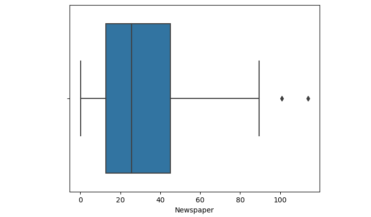
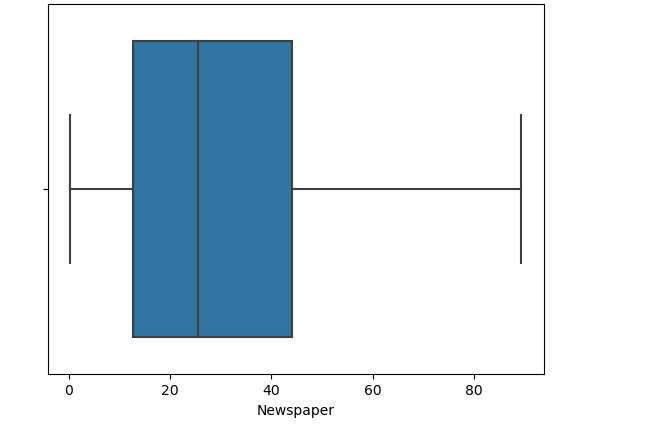
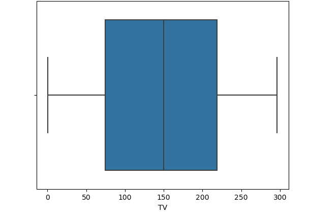
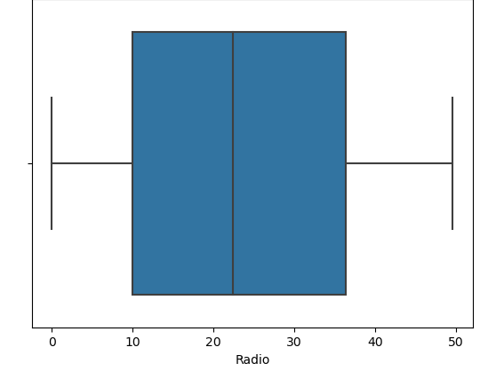
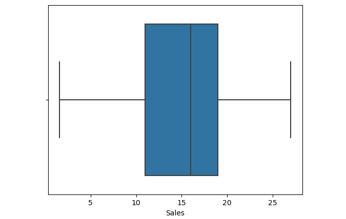
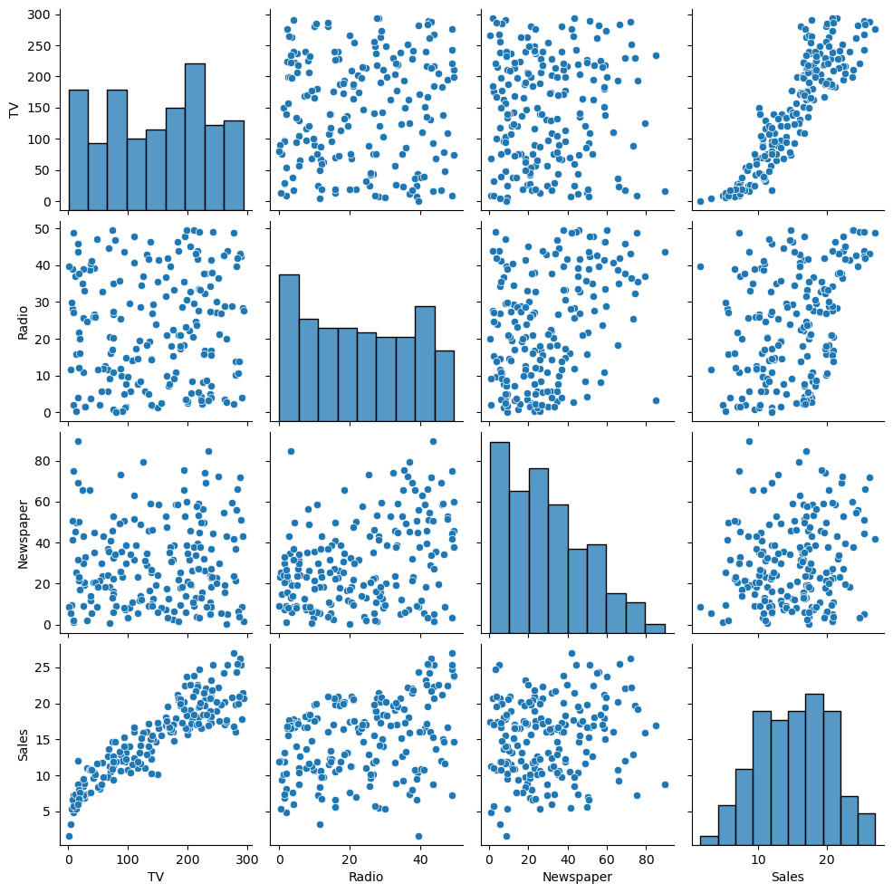

# P1_DataSciences: Sales Prediction
This data science project focuses on leveraging predictive modeling techniques to forecast sales trends and optimize business strategies. By analyzing historical sales data and external factors influencing sales performance, this project aims to provide actionable insights for enhancing revenue generation and improving decision-making processes.

## Problem Statement:
Determining the most effective advertising platform for driving sales involving analyzing various factors such as the reach and engagement levels of each platform, the target audience, and the overall cost-effectiveness of advertising on TV versus radio. By evaluating these factors, businesses can make informed decisions on where to allocate their advertising budget to maximize sales and enhance their Return on investment (ROI).

## Objective
Use machine learning techniques to analyze historical data on ad spend and sales performance to predict future sales and identify which platform is more influential in driving sales, aiding in strategic decision-making and optimizing advertising budget allocation.

## Stages Progress:
### Part 1:
- Problem statement and Objective defined.
- Data has been uploaded in csv format called Advertising.csv
- Jupiter Python: will be used to do the Part 2, 3 and 4.

### Part 2:
- Data is clean: No missing values or Errors identified.
- But I have identified two outliers in a Newspaper dataset and subsequently removed them to ensure the accuracy of the data analysis and modeling. However, I also encountered two blank spaces[missing values] that had to be removed to further refine the dataset. By addressing these outliers and missing values, the data is now more reliable for future analysis and decision-making purposes.

Newspaper with Outliers:

### Part 3:
- Model to be used for Training, testing and making prediction is Multiple Linear Regression.
<<<<<<< HEAD
- Multiple Linear Regression: Because there are multiple predictors that could potentially influence the dependent variable which are (TV, Radio and Newspaper) which leads us to a more comprehensive understanding of the relationship between the predictors and the outcome variable.

## Exploratory Data Analysis: INSIGHT
### Newspaper:
- The dataset moved closer to Quantile 1 suggesting that the distribution where a larger proportion of values are clustered towards the lower end of the range, indicating a potential shift towards lower values. This adjustment in the data placement in relation to Quantile 1 can provide insights into changes in the distribution and may impact the overall analysis and interpretation of the dataset. Understanding such movements in relation to key quantiles can help in identifying potential trends or anomalies within the dataset.

(Newspaper)

### TV
- The dataset of TV advertising is centered between the first and third quartiles suggesting a relatively balanced distribution of advertising spending across the range of values. This indicates a more even spread of investment in TV advertising, with similar numbers of observations falling below and above the median. Such a distribution may imply a stable and consistent pattern of TV advertising expenditure that does not heavily favor any particular range of values. Such a distribution may imply a moderate level of variation and can be considered a relatively symmetric dataset in terms of its spread and positioning within the interquartile range.

Monitoring this distribution can help assess the overall effectiveness and efficiency of TV advertising strategies.

### Radio
- The dataset of radio advertising is slightly skewed to the left with the median moving towards the third quartile suggesting that the distribution where the majority of advertising values are concentrated towards the higher end of the dataset. This shift in the median indicates a potential upward trend in advertising spending, with more values falling in the upper range. Monitoring this movement can provide insights into evolving advertising strategies and investment patterns within the industry.
 

### Sales:
- The dataset is positioned between the first and third quartiles with a median shifting towards the third quartile suggesting that the distribution is becoming increasingly right-skewed. This indicates a potential upward trend in sales figures, with a concentration of values towards the higher end of the scale. Monitoring this shift in the median can provide valuable insights into the changing dynamics of sales performance and potentially guide strategic decision-making in response to these developments.

## Relationship between Advertising and Sales

### Generated Sales from TV advertising
Based on the the results above, the relationship of sales to TV indicates that there appears to be a positive correlation between the two variables. As TV advertising expenditure increases, sales also tend to increase, indicating a potential relationship where higher advertising investments may lead to higher sales outcomes. 

This trend suggests that TV advertising could be a driving factor in boosting sales performance and that further exploration and optimization of advertising strategies may yield positive results for the sales metrics.

### Generated Sales from Radio and Newspaer advertising
Radio and Newspaper relationship with sales, indicates  a lack of clear direction due to the dispersed spread of data points across the plot. This suggests that there may not be a strong and consistent relationship between the amount spent on Radio and Newspaper advertising and sales generated. The wide distribution of data points may indicate that other factors beyond Radio and Newspaper advertising expenditure play a significant role in influencing sales. further analysis and consideration of additional variables are warranted to better understand the factors impacting sales in this scenario.

## Conclusion:
- Based on our data analysis, it is recommended that the business should invest more in TV advertisement as the results indicate better performance compared to other media channels. The data suggests that TV advertisement yields more favorable outcomes and could be a lucrative investment for the business in reaching its target audience and driving sales. Further allocation of resources towards TV advertisement may lead to higher returns and increased visibility for the business.

While radio advertising may require some adjustments to improve its performance, the potential shown by TV advertisements indicates that it can be a strong driver of success. However, with further refinement, the radio channel has the potential to challenge TV in terms of effectiveness, making it a viable option for consideration alongside TV advertising for the business.

Additionally, our analysis suggests that spending less on newspaper advertising could be a strategic move to allocate resources more efficiently and capitalize on the strengths of TV and radio campaigns.

## MODELLING: INSIGHT
### mean squared error (MSE):
- The mean squared error (MSE) of the trained data is 2.8332174960409424, while the MSE of the testing data is 2.415728945593507. The lower MSE value of the testing data indicates that the model performs slightly better on unseen data compared to the trained data. These MSE values suggest that the model may have achieved a reasonably good fit during training but may need further refinement or tuning to improve its predictive performance on novel data.

### Metrics
- The performance metrics of the model on the training data resulted in a score of 0.8973073018699194, while on the testing data, the score increased to 0.9130003152798273. The higher metric score on the testing data indicates that the model generalizes well and performs better on unseen data. This improvement in performance from training to testing data suggests that the model has robust predictive capabilities and is not overfitting the training data.

### Training Set on Predicted sales vs Actual Sales
=======
- Multiple Linear Regression: Because there are multiple predictors which are (TV, Radio and Newspaper) that could potentially influence the dependent variable and leads us to a more comprehensive understanding of the relationship between the predictors and the outcome variable.
>>>>>>> ddc63b7ec79a5506f9424bd82bae9caf4777e720
